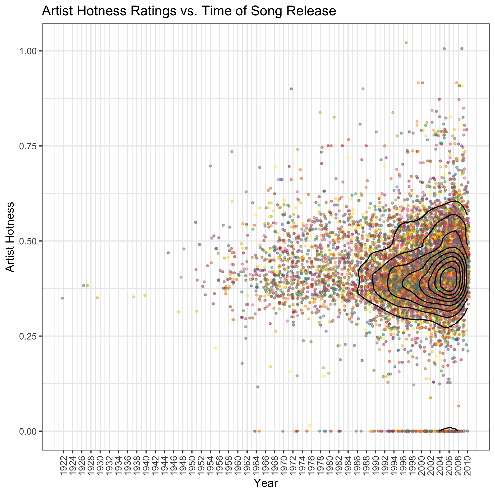
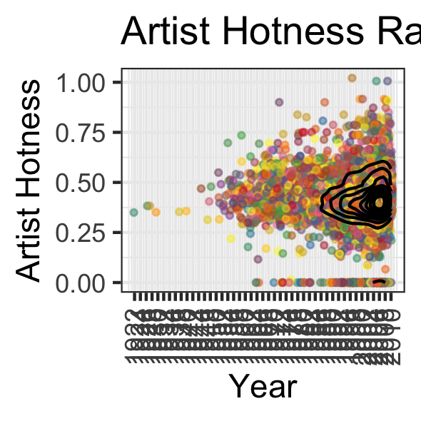
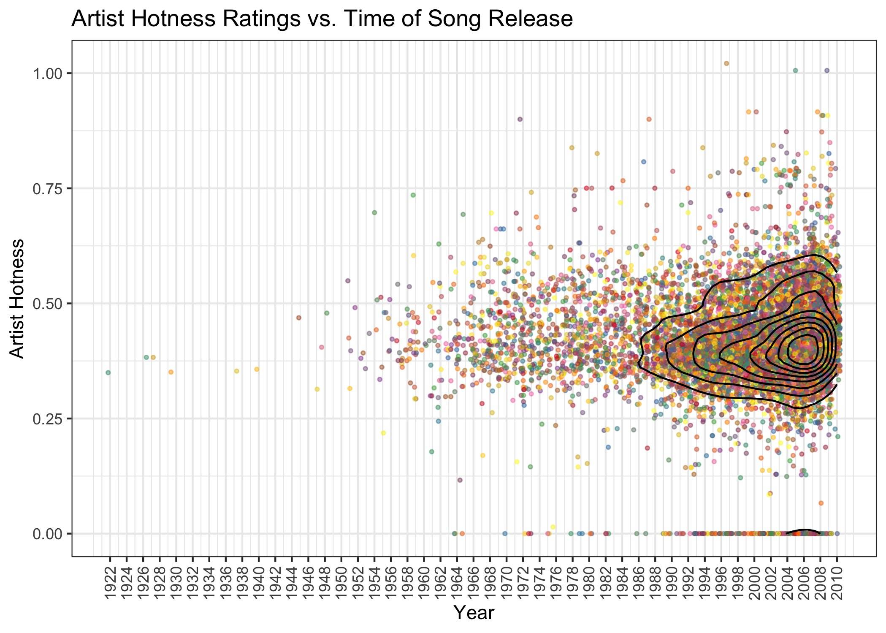

```{r setup, include=FALSE}
knitr::opts_chunk$set(echo = TRUE,warning=FALSE,message=FALSE)
knitr::opts_chunk$set(tidy.opts=list(width.cutoff=60),tidy=FALSE)
options(digits=2)
options(scipen = 999)
set.seed(16)
```

In this document we present some data exploration completed using the `singer` dataset accessed from GitHub. We will use the packages `tidyverse`, `devtools`, `RColorBrewer`, `plotly`, `svglite`, and `ggplot2` from R, as well as `singer` from GitHub.

```{r}
library(tidyverse)
library(ggplot2)
library(devtools)
devtools::install_github("JoeyBernhardt/singer")
library(singer)
library(RColorBrewer)
library(plotly)
library(svglite)
library(stringr)
```

The sections of this document are as follows:

* Loading in and Checking the Data
* Exploring the Effects of `arrange` on the Creation of a Figure in a Subset of the Data
* Dropping Year 0 Entries From the Full Data Set
* Reordering the Levels of `artist_name` Based on `artist_hotttnesss`
* Exploring the Effects of Reordering the Levels of `artist_id` on the Creation of the Previous Figure
* Experimenting With File Writing and Reading
* Creating a New Visualization
* Converting Visualization to Plotly
* Writing Figures to File
* Bonus, Separating Locations in the City Column

# Loading in Data and Checking its Structure

First, we load the data

```{r}
# Call to data frame
data("singer_locations")
```

```{r include=FALSE}
attr(singer_locations, "spec")=NULL
```

Next, we can look at some information on how these data sets are organized.

```{r}
# Determine what we can about the object 'singer_locations'
str(singer_locations)
```

The object `singer_locations` has 10100 rows and 14 columns, and is a 'tbl_df', a tibble data frame. Before looking at the different variables and their values taken, we can correct where factor variables were loaded as character vectors instead of factors. We can also omit some variables we know we won't look at: `duration, latitude, longitude, artist_familiarity, name`.

```{r}
# Since "as.data.frame" actually likes keeping factors as factors, we can take the data frame apart and put it back together for it to save everything as a factor.
singer_locations = singer_locations %>%
  select(-duration,-latitude,-longitude,-artist_familiarity,-name) %>%
  unclass() %>%
  as.data.frame()
```

Now, we can call once more to the `str()` function. We can also see how many values are missing from each column.

```{r}
str(singer_locations)
# Check amount missing from each column
sapply(singer_locations,function(x) length(which(is.na(x))))
```

And after this adjustment, the 10 variables can be described as follows:

* `track_id` marks a unique track ID. A factor with `r length(unique(singer_locations$track_id))` levels, there is one unique track ID per row.
* `title` notes a songs title. A factor with `r length(unique(singer_locations$title))` levels, meaning there are only `r length(unique(singer_locations$title))` unique song titles out of the `r length(unique(singer_locations$track_id))` unique songs listed.
* `song_id` marks a unique song ID. A factor with `r length(unique(singer_locations$song_id))` levels, there is one unique song ID per row.
* `release` is the album title matching the song in question. A factor with `r length(unique(singer_locations$release))` levels, meaning the `r length(unique(singer_locations$track_id))` songs come from `r length(unique(singer_locations$release))` different albums.
* `artist_id` is a code which identifies the artist who created the song. A factor with `r length(unique(singer_locations$artist_id))` levels, meaning the `r length(unique(singer_locations$track_id))` songs come from this many unique artists.
* `artist_name` is the artist's name at the time of publishing the song. A factor with `r length(unique(singer_locations$artist_name))` levels, indicating artists may have had different official names for different published songs.
* `year` as a numerical variable marks year of song release.
* `artist_hotttnesss` as a numerical variable marks an indication of artist popularity.
* `city` marks the city of song release. A factor with `r length(unique(singer_locations$city))-1` levels and `r length(which(is.na(singer_locations$city)))` missing values, indicating that of the `r nrow(singer_locations)-length(which(is.na(singer_locations$city)))` songs for which we have a city listed, there are `r length(unique(singer_locations$city))-1` unique locations.

# Dropping Year 0 Entries From the Full Data Set

See the summary at the end of the previous section to recall the full data set we are working with. Importantly, we have a data set with `r nrow(singer_locations)` observations. Now, let us drop the entries of 0 in the year column. We will also drop unused levels after filtering the data in this way.

```{r}
singer_locations_filtered = singer_locations %>%
  filter(year != 0) %>%
  droplevels()

str(singer_locations_filtered)
```

We can observe that

* The data set has gone from having 10100 rows to having 10000 rows, indicating that 100 songs had a year of 0 in the dataset.
* The `track_id` and `song_id` factors (which have unique entries per row) shifted to reflect this, and now only have 10000 levels as well.
* There are now 9703 unique song titles, as opposed to 9799, indicating that 96 of the unique song names no longer appear in the data set after removing these 100 songs.
* There are now 8956 levels in the `release` factor instead of 9049, meaning that 93 albums had all of their songs removed from the data set at this diltering step.
* There are now 7258 different levels in `artist_id` instead of 7346, indicating that 88 artists had all of their songs removed from the data set at this filtering step.
* There are now 7408 different levels in `artist_name` instead of 7498, indicating that 90 unique artist names no longer appear in the data set after the filter, which implies that 2 of the 88 artists who had all of their songs removed had songs removed that were under different street names.
* There are now 1308 levels in `city` instead of 1316, implying that 8 cities no longer appear as publishing locations in the data set after this filtering step.

# Exploring the Effects of `arrange` on the Creation of a Figure in a Subset of the Data

We will only select a random 50 songs to examine data for, and we will only look at hotness level, artist name, arist id, and year.

```{r}
sample.artists = sample(unique(singer_locations_filtered$artist_name),50)

singer_locations_sample = singer_locations_filtered %>%
  filter(artist_name %in% sample.artists) %>%
  select(artist_hotttnesss,artist_name,year) %>%
  droplevels()
```

Let us summarize these variables now

```{r}
str(singer_locations_sample)
```

* We have `r nrow(singer_locations_sample)` observations of song artists and hotness levels and release years.
* `artist_name` has `r nlevels(singer_locations_sample$artist_name)` levels.

Let us create a figure, rearrange by a factor variable and then see if the figure changes at all. It will not, because factor level order does not change as a result of the `arrange` function, so our plot won't see the data as being any different after arranging.

First, let us check that the data set is not already in alphabetical order by artist_id, and that arranging it will change the data order.

```{r}
head(singer_locations_sample)
singer_locations_sample %>%
  arrange(artist_name) %>%
  head()
```

We see that rearranging the data does change its order.

Now let us create a simple plot of artist popularity for the 50 selected songs, and we colour by year of song's release.

```{r}
# Plot before rearrangement
ggplot(singer_locations_sample,aes(y=artist_name,x=artist_hotttnesss,colour=year))+
  geom_point()+
  scale_colour_distiller(palette = 'YlOrRd')+
  theme_dark()+
  labs(x='Artist Hotness',y='Artist')
```

Now, let us verify that the plot will be the exact same if we rearrange the data before making the plot. Let us arrange `artist_id` in alphabetical order, and remake the plot.

```{r}
# Plot after rearrangement
singer_locations_sample %>%
  arrange(artist_name) %>%
  ggplot(aes(y=artist_name,x=artist_hotttnesss,colour=year))+
  geom_point()+
  scale_colour_distiller(palette = 'YlOrRd')+
  theme_dark() +
  labs(x='Artist Hotness',y='Artist')
```

And here we see that rearranging the data before creating the figure made no difference whatsoever in how the final figure appeared.

# Reordering the Levels of `artist_name` Based on `artist_hotttnesss` in the Full Data Set

We will reorder the levels of `artist_name` by the minimum hotness level observed by all songs by the artist.

```{r}
# Rearrange factor levels
singer_locations_filtered$artist_name = singer_locations_filtered$artist_name %>%
  fct_reorder(singer_locations_filtered$artist_hotttnesss,min)
```

And now if we examine the first 8 levels in the factor, alongside the first 8 levels in the factor in the original data set,

```{r}
# Compare first few factor levels
data.frame(new=levels(singer_locations_filtered$artist_id)[c(1,2,3,4,5,6,7,8)],original=levels(singer_locations$artist_id)[c(1,2,3,4,5,6,7,8)])
```

We see that in the original data set, the levels were alphabetically ordered, while in the updated data set the levels are not.

# Exploring the Effects of Reordering the Levels of `artist_id` on the Creation of the Same Figure in a Subset of the Data

Let us make the same figure as previously, using the same subset of the data, but this time taking the subset from the data with the reordered factor.

```{r}
# Start arranging data to create same plot as before
singer_locations_sample2 = singer_locations_filtered %>%
  filter(artist_name %in% sample.artists) %>%
  select(artist_hotttnesss,artist_name,year) %>%
  droplevels()

str(singer_locations_sample2)
```

We see the same data structure as before, as expected. Now, let us create the same plot as we did before.

```{r}
# Examine same plot as before but with reordered factor levels
ggplot(singer_locations_sample2,aes(y=artist_name,x=artist_hotttnesss,colour=year))+
  geom_point()+
  scale_colour_distiller(palette = 'YlOrRd')+
  theme_dark()+
  labs(x='Artist Hotness',y='Artist')
```

And we can see that by reordering the factor levels, we have impacted how a plot appears, when by rearranging the data set we could not.

# Experimenting With File Writing and Reading

Right now we have two data sets that are samples from the filtered `singer_locations` object `singer_locations_filtered`. The two sample data sets are called `singer_locations_sample` and `singer_locations_sample2`. Reviewing the structure of these, we have

```{r}
# See that only factor level order differs
str(singer_locations_sample)
str(singer_locations_sample2)
```

What has happened is we have two identical subsets of the filtered data set, but with different orders of factor levels in `artist_name`.

We can see that the data sets are technically not 'identical' because of these different factor orders, even though they technically hold the exact same information in the same dimension and with the same column contents. Indeed, this can be checked in R

```{r}
# Check that these data sets are considered different
identical(singer_locations_sample,singer_locations_sample2)
```

Now, this will be useful when exploring writing and reading files, because we can see whether these objects become identical after writing and reading them using different methods. For example, let us write both of these data sets into CSV files, then read them back into R, and then check if R now sees them as identical.

```{r}
# Write to csv and read back, check if they are still different
write.csv(singer_locations_sample,'sample1.csv',row.names=FALSE)
write.csv(singer_locations_sample2,'sample2.csv',row.names=FALSE)

csv1 = read.csv('sample1.csv',header=TRUE)
csv2 = read.csv('sample2.csv',header=TRUE)

identical(csv1,csv2)
```

We see that writing to CSV and reading the data sets back made them identical, meaning the ordering of the factors must now be the same. Indeed, we can see this manually as well

```{r}
data.frame(sample1.levels = levels(csv1$artist_name)[c(1,2,3,4,5)],sample2.levels = levels(csv2$artist_name)[c(1,2,3,4,5)])
```

We see from comparing the first few levels that they are purely alphabetical.

Let us try this with the `saveRDS` and `readRDS` functions instead.

```{r}
# Write to RDS and read back, check if they are still different
saveRDS(singer_locations_sample,'RDS1')
saveRDS(singer_locations_sample2,'RDS2')

RDS1 = readRDS('RDS1')
RDS2 = readRDS('RDS2')

identical(RDS1,RDS2)
```

We see that the two objects aren't identical, and we can in fact see that the two objects still have different orders of factors of `artist_name`.

```{r}
data.frame(sample1.levels = levels(RDS1$artist_name)[c(1,2,3,4,5)],sample2.levels = levels(RDS2$artist_name)[c(1,2,3,4,5)])
```

Where we see that the reordering of the factor levels was mantained in the second data set.

Lastly, let us do this comparison with `dput` and `dget`

```{r}
# Write and read back using dput and dget, check if they are still different
dput(singer_locations_sample,'dput1')
dput(singer_locations_sample2,'dput2')

dput1 = dget('dput1')
dput2 = dget('dput2')

identical(dput1,dput2)
```

We see that the two objects aren't identical, and we can in fact see that the two objects still have different orders of factors of `artist_name`.

```{r}
data.frame(sample1.levels = levels(dput1$artist_name)[c(1,2,3,4,5)],sample2.levels = levels(dput2$artist_name)[c(1,2,3,4,5)])
```

Where we see that the reordering of the factor levels was mantained in the second data set.

Thus, in conclusion, we see that `saveRDS` and `readRDS` as well as `dput` and `dget` are able to preserve factor ordering in data sets, while `write.csv` and `read.csv` are not.

# Creating a New Visualization

Because there were so many data points, and so many of the variables were factors with thousands of levels, it was difficult to determine how best to incorporate the data into an interesting plot. I decided to see how the values of 'artist hotness' appeared to change over the years. I know that there will be 10,000 points on this plot, and there's no clear summary statistics that could consolidate information (I could form a new data set with only the mean hotness level per *artist* instead of *song*, but then I'd still have 7258 points instead of 10000, so this barely helps, and I would have to consolidate 'year' information across multiple songs, and so I don't do this).

For my initial plots, I decide to try two things. I plot all the points to see if there needs to be changes before interpretation, which is likely.

```{r}
# Create simplest plot to start with
singer_locations_filtered %>%
  ggplot(aes(x=year,y=artist_hotttnesss))+
  geom_point()
```

We see that the plot doesn't offer much easy interpretation, because many points are still overlapping. We are however able to form the observation that perhaps the spread of hotness scores has been increasing over the years.

Some steps that I took to consolidate all this information into a more useful plot are as follows.

* Decrease the size of the points.
* Jitter the points only horizontally by at most 0.5 years in either direction, so years won't overlap but the points can separate a bit more.
* Give points varying colours from a lighter palette to be easier on the eyes. I will colour points by artist_id, but not for the point of comparing artists, more so to differentiate points easier. I will also ensure that no legend with 7258 levels tries to appear.
* Make points slightly transparent.
* Place more year tics on the X axis to make it easier to match points to their year.
* Rotate the years on the X axis because they will start to overlap when I put more labels.
* Relabel the X and Y axis with nicer titles.
* Title the plot.
* Use the black and white theme instead of the standard grey.
* Even with these changes, there will likely be significant point overlap, so I will add contour lines to help show where density is highest.
* Make contour lines black to contrast the light palette of the points.

```{r}
# Recreate last plot with all described changes
plot=singer_locations_filtered %>%
  ggplot(aes(x=year,y=artist_hotttnesss))+
  geom_jitter(aes(colour=title,group=artist_name),size=0.75,width=0.4,height=0,alpha=0.5)+
  guides(colour=FALSE)+
  stat_density_2d(colour='black',bins=9)+
  scale_colour_manual(values=colorRampPalette(brewer.pal(8, 'Set1'))(length(unique(singer_locations_filtered$title))))+
  labs(y="Artist Hotness",x="Year")+
  ggtitle('Artist Hotness Ratings vs. Time of Song Release')+
  scale_x_continuous(breaks=seq(1922,2010,by=2))+
  theme_bw()+
  theme(axis.text.x = element_text(angle = 90, hjust = 1,vjust=0.5))

plot
```

We can now see the distribution of artist hotness over time much more clearly. It does indeed seem to be the case that as time has gone on, so have the number of songs overall, but also the spread of these song's artist's hotness ratings. This plot is much easier to see this in than the previous plot, and we've fixed a lot of the issues with interpreting the first plot. We can match years to points easier, and we can differentiate points better thanks to the transparency, resizing, and jitter. The jitter also removed the distracting visual pattern of clumping data in vertical lines. The colour scheme also allows us to easily see the contour lines separately from the points.

It was interesting to learn a lot of the things that I ended up applying to this plot. When I rotated the X axis ticks, I had to employ the `vjust` argument to make the labels line up with the tics, which took multiple attempts. My usual method of removing legends is adding the layer `theme(legend.position='none')`, but I found that this was incompatible with the layer `theme_bw()`, as one would overwrite the other, so I had to employ an alternative way to remove the legend, by arguing `guides(colour=FALSE)`. I also learned that the `geom_density_2d` doesn't allow an easy way to declare the number of contours to draw, and I spent a good deal of time trying to learn how to use the `bandwidth.nrd()` function and use that to properly tweak how it drew the contours, before I realized I had made the task too complicated and I could in fact use `stat_density_2d` which had the `bins` argument. It was also interesting to learn how to differentiate between horizontal and vertical jitter using the `width` and `height` arguments. Lastly, it was interesting to learn how to apply `RColorBrewer` palettes to factors with more than the usual maximum number of levels. I learned how to use `colorRampPalette` to take a sample from a standard palette and expand it to a larger number of levels.

# Converting Visualization to Plotly

```{r}
attach(singer_locations_filtered)

# Declare some information to be used in axes formatting
f <- list(
  family = "Courier New, monospace",
  size = 18,
  color = "black"
)
x <- list(
  title = "Year (With Jitter)",
  titlefont = f,
  autotick = FALSE,
  dtick=2
)
y <- list(
  title = "Artist Hotness",
  titlefont = f
)

# Create plotly plot by adding scatter plot on top of contour
p = plot_ly(x = year, 
        y = artist_hotttnesss,
        text = ~paste('Song: ', title,'. Artist: ',artist_name)) %>% 
  add_histogram2dcontour(showscale=FALSE,
                         ncontours=10,
                         colorscale='black',
                         contours = list(coloring='none')) %>%
  add_markers(x = year+runif(length(year),-0.5,0.5),
              y = artist_hotttnesss,
              marker=list(size=2.5),
              opacity=0.5,
              color=I("orangered3")) %>%
  layout(xaxis = x, 
         yaxis = y,
         showlegend=FALSE)

htmlwidgets::saveWidget(p, file = "plotly_plot.html")
```

This plot can be found [here](https://stat545-ubc-students.github.io/hw05-ericjsanders/plotly_plot.html)!

The plot is very interesting because it captures the same infomation as previously, as well as additional information, and it has additional capabilities for interaction! There are no longer different colours for different artists, but when a song is moused over, the song title and artist name are given, which is more useful than previous. Furthermore, the zooming capabilities of a plotly figure are always incredibly useful. As an example of something we can tell form this plot but not the previous one. As an example of something that you can see in the second plot but not the first plot, if you mouse over the highest score song in 2009, you can see it is "Boom Boom Pow" by the "Black Eyed Peas", an excellent song.

# Writing Figures to File

We will be working with the final ggplot graph shown previously, which was saved into the object `plot`.

I will save the plot object three different ways, and then embed the three plots in the same order to observe how the image files differ.

```{r}
ggsave('gg1.png',plot=plot,device=png())
ggsave('gg2.png',plot=plot,device=png(),dpi=72)
ggsave('gg3.png',plot=plot,device=png(),width=5,height=5,units='cm')
ggsave('gg4.png',plot=plot,device=png(),scale=0.5)
```

Now we can call to them in order.

First, the plot with no special arguments.



Second, the plot with a `dpi` argument.


Third, the plot with changed width and height parameters.



Fourth, the plot with a `scale` argument.


We see that in all of the above plots, the dpi argument preserved the proportional size of text in axis labels and the size of points in the plot. In comparison, the width and height arguments or the scale argument do not preserve the proportional size of text and points.

Now that we have played with the arguments of the `ggsave`, we can play with the different graphic devices.

```{r}
ggsave('gg5.jpeg',plot=plot,device='jpeg')
ggsave('gg6.pdf',plot=plot,device='pdf')
ggsave('gg7.svg',plot=plot,device='svg')
```

Now let us attempt to look at these figures.

First, the .jpeg file. JPEG's are examples of rasterized images.



Second, the .pdf file. PDF's are examples of rasterized images.


Third, the .svg file. SVG's are examples of vectorized images.


PDF's aren't usually created in order to be inserted into other documents, so we can see that R Markdown presented it less nicely.

Rasterization vs. vectorization of images generally becomes most relevant when resizing or changing images, so we see in this case little difference between the saved and loaded rasterized and vectorized images that weren't resized.

The biggest case I know of in which we might want to use `ggsave()` and then present an image manually in a markdown document is when presenting results of very complicated R code that takes a great deal of time to run. For example, in simulation studies or complex Bayesian modelling, code often has to run for a great deal of time and look at many different situations while generating and collecting data. In these cases, one would hopefully run their code with an internal request to save plots of interest, and later when a presentation of results is put together, the images can be called to and presented, and thus the rendering of the presentation file does not always require an incredibly long time for code to run.

# Bonus, Separating Locations in the City Column

First, I will generate a list of the factor levels of the `city` column that contain two commas, so I can select some levels that have clear entries separating city, region, and country. This can be done using the `stringr` package, which has a useful function called `str_count` that counts the number of occurences of a certain pattern in each element of a vector of strings.

```{r}
# Look at unique cities
unique.locs = unique(singer_locations_filtered$city)
# Pick out unique cities with 2 commas in entry
unique.locs[which(str_count(unique.locs,',')==2)]
```

I manually look at this list of levels, and manually select some that are properly formatted for the desired manipulation.

```{r}
chosen.locs = unique.locs[which(str_count(unique.locs,',')==2)][c(1,2,3,4,7,8,9,18,20,22,44,48)]

# Filter data to only contain these city entries

simple.city.sample = singer_locations_filtered %>%
  filter(city %in% chosen.locs) %>%
  droplevels() %>%
  mutate(city = as.character(city))

str(simple.city.sample)
```

So we have this small subset of the data, and we wish to not separate the city factor into three factors containing just the city, just the region, and just the country of each original city entry.

First, I use the `gregexpr` function to calculate all the character indices for each city entry of the first comma, and the indices for the second comma. The `first.comma` vector has the character index for each city entry's first comma. The `second.comma` vector has the character index for each city entry's second comma. Because `gregexpr` returns both of these pieces of information in a complicated structure, it was necessary to use the `lapply` function to extract the first comma indices as the first element of the first list in each entry of the list of lists it produced, and to use the `lapply` function to extract the second comma indices as the second element of the first list in each entry of the list of lists it produced. You can see how this got a bit confusing, and it was difficult to get to work perfectly.

```{r}
# Take indices of comma entries in the list of strings
first.comma = unlist(lapply(gregexpr(pattern=',',simple.city.sample$city), `[[`, 1))
second.comma = unlist(lapply(gregexpr(pattern=',',simple.city.sample$city), `[[`, 2))
```

Lets see how this looks, by comparing the city entries to these comma indices and seeing if they look correct.

```{r}
# Confirm column indices are correct
cbind(simple.city.sample$city,first.comma,second.comma)
```

While tedious, you can indeed check that the comma indices are indeed the character count in the corresponding city entry before you get to the comma in question. Now, we can use the `substr` function in R to take correct substrings of the city entry for the new variables we want to define! We can do this inside of a `mutate` function.

```{r}
# Take substrings in mutate function
simple.city.sample = simple.city.sample %>%
  mutate(region=substr(city,first.comma+2,second.comma-1),
         country=substr(city,second.comma+2,nchar(city)),
         city=substr(city,1,first.comma-1))
```

Let us call to the columns that we now have to see how they look!

```{r}
# Take just the new location columns
simple.city.sample[,c(9,10,11)]
```

And it looks like we have adequately separated the location information!

We can now see how the data are organized.

```{r}
simple.city.sample %>%
  unclass() %>%
  as.data.frame() %>%
  str()
```

And finally it appears we have done our job and have completed all the tasks we set out to with the data set.