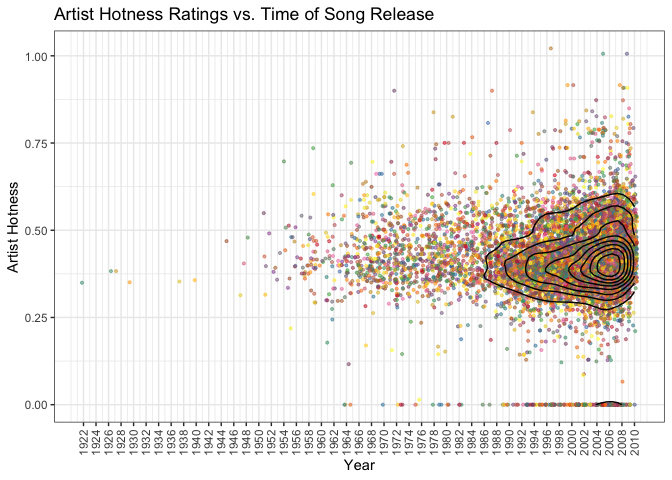
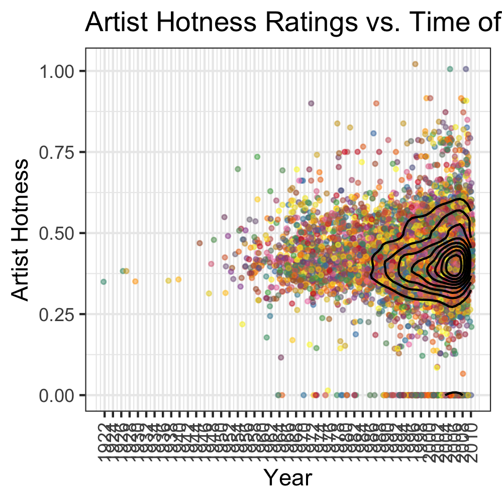

Stat545 Homework 5
================
Eric Sanders
Submitted for 2018-10-19


In this document we present some data exploration completed using the `singer` dataset accessed from GitHub. We will use the packages `tidyverse`, `devtools`, `RColorBrewer`, `plotly`, `svglite`, and `ggplot2` from R, as well as `singer` from GitHub.

``` r
library(tidyverse)
library(ggplot2)
library(devtools)
devtools::install_github("JoeyBernhardt/singer")
library(singer)
library(RColorBrewer)
library(plotly)
library(svglite)
library(stringr)
```

The sections of this document are as follows:

-   Loading in and Checking the Data
-   Exploring the Effects of `arrange` on the Creation of a Figure in a Subset of the Data
-   Dropping Year 0 Entries From the Full Data Set
-   Reordering the Levels of `artist_name` Based on `artist_hotttnesss`
-   Exploring the Effects of Reordering the Levels of `artist_id` on the Creation of the Previous Figure
-   Experimenting With File Writing and Reading
-   Creating a New Visualization
-   Converting Visualization to Plotly
-   Writing Figures to File
-   Bonus, Separating Locations in the City Column

Loading in Data and Checking its Structure
==========================================

First, we load the data

``` r
# Call to data frame
data("singer_locations")
```

Next, we can look at some information on how these data sets are organized.

``` r
# Determine what we can about the object 'singer_locations'
str(singer_locations)
```

    ## Classes 'tbl_df', 'tbl' and 'data.frame':    10100 obs. of  14 variables:
    ##  $ track_id          : chr  "TRWICRA128F42368DB" "TRXJANY128F42246FC" "TRIKPCA128F424A553" "TRYEATD128F92F87C9" ...
    ##  $ title             : chr  "The Conversation (Cd)" "Lonely Island" "Here's That Rainy Day" "Rego Park Blues" ...
    ##  $ song_id           : chr  "SOSURTI12A81C22FB8" "SODESQP12A6D4F98EF" "SOQUYQD12A8C131619" "SOEZGRC12AB017F1AC" ...
    ##  $ release           : chr  "Even If It Kills Me" "The Duke Of Earl" "Imprompture" "Still River" ...
    ##  $ artist_id         : chr  "ARACDPV1187FB58DF4" "ARYBUAO1187FB3F4EB" "AR4111G1187B9B58AB" "ARQDZP31187B98D623" ...
    ##  $ artist_name       : chr  "Motion City Soundtrack" "Gene Chandler" "Paul Horn" "Ronnie Earl & the Broadcasters" ...
    ##  $ year              : int  2007 2004 1998 1995 1968 2006 2003 2007 1966 2006 ...
    ##  $ duration          : num  170 107 528 695 237 ...
    ##  $ artist_hotttnesss : num  0.641 0.394 0.431 0.362 0.411 ...
    ##  $ artist_familiarity: num  0.823 0.57 0.504 0.477 0.53 ...
    ##  $ latitude          : num  NA 41.9 40.7 NA 42.3 ...
    ##  $ longitude         : num  NA -87.6 -74 NA -83 ...
    ##  $ name              : chr  NA "Gene Chandler" "Paul Horn" NA ...
    ##  $ city              : chr  NA "Chicago, IL" "New York, NY" NA ...

The object `singer_locations` has 10100 rows and 14 columns, and is a 'tbl\_df', a tibble data frame. Before looking at the different variables and their values taken, we can correct where factor variables were loaded as character vectors instead of factors. We can also omit some variables we know we won't look at: `duration, latitude, longitude, artist_familiarity, name`.

``` r
# Since "as.data.frame" actually likes keeping factors as factors, we can take the data frame apart and put it back together for it to save everything as a factor.
singer_locations = singer_locations %>%
  select(-duration,-latitude,-longitude,-artist_familiarity,-name) %>%
  unclass() %>%
  as.data.frame()
```

Now, we can call once more to the `str()` function. We can also see how many values are missing from each column.

``` r
str(singer_locations)
```

    ## 'data.frame':    10100 obs. of  9 variables:
    ##  $ track_id         : Factor w/ 10100 levels "TRAAAIR128F1480971",..: 8695 9089 3288 9390 749 3998 7323 9231 1273 3791 ...
    ##  $ title            : Factor w/ 9799 levels "¿ Cómo_ cuándo y porqué ( Why do I love you so )",..: 8139 4891 3381 6679 2917 5450 6122 2408 3630 180 ...
    ##  $ song_id          : Factor w/ 10100 levels "SOAACEN12A8C13AC90",..: 7487 1320 6771 2088 6247 3216 3468 1557 1252 2257 ...
    ##  $ release          : Factor w/ 9049 levels "! Ich Kann","¡Esta!",..: 2355 7424 3531 6855 365 6514 2306 6739 4328 6272 ...
    ##  $ artist_id        : Factor w/ 7346 levels "AR002UA1187B9A637D",..: 1989 6984 807 5330 1381 2409 1605 4169 3762 5062 ...
    ##  $ artist_name      : Factor w/ 7498 levels "'t Hof Van Commerce",..: 4458 2487 4943 5439 1897 585 7247 7393 5763 5204 ...
    ##  $ year             : int  2007 2004 1998 1995 1968 2006 2003 2007 1966 2006 ...
    ##  $ artist_hotttnesss: num  0.641 0.394 0.431 0.362 0.411 ...
    ##  $ city             : Factor w/ 1316 levels "?, Illinois",..: NA 225 804 NA 305 910 NA NA NA NA ...

``` r
# Check amount missing from each column
sapply(singer_locations,function(x) length(which(is.na(x))))
```

    ##          track_id             title           song_id           release 
    ##                 0                 0                 0                 0 
    ##         artist_id       artist_name              year artist_hotttnesss 
    ##                 0                 0                 0                 0 
    ##              city 
    ##              5971

And after this adjustment, the 10 variables can be described as follows:

-   `track_id` marks a unique track ID. A factor with 10100 levels, there is one unique track ID per row.
-   `title` notes a songs title. A factor with 9799 levels, meaning there are only 9799 unique song titles out of the 10100 unique songs listed.
-   `song_id` marks a unique song ID. A factor with 10100 levels, there is one unique song ID per row.
-   `release` is the album title matching the song in question. A factor with 9049 levels, meaning the 10100 songs come from 9049 different albums.
-   `artist_id` is a code which identifies the artist who created the song. A factor with 7346 levels, meaning the 10100 songs come from this many unique artists.
-   `artist_name` is the artist's name at the time of publishing the song. A factor with 7498 levels, indicating artists may have had different official names for different published songs.
-   `year` as a numerical variable marks year of song release.
-   `artist_hotttnesss` as a numerical variable marks an indication of artist popularity.
-   `city` marks the city of song release. A factor with 1316 levels and 5971 missing values, indicating that of the 4129 songs for which we have a city listed, there are 1316 unique locations.

Dropping Year 0 Entries From the Full Data Set
==============================================

See the summary at the end of the previous section to recall the full data set we are working with. Importantly, we have a data set with 10100 observations. Now, let us drop the entries of 0 in the year column. We will also drop unused levels after filtering the data in this way.

``` r
singer_locations_filtered = singer_locations %>%
  filter(year != 0) %>%
  droplevels()

str(singer_locations_filtered)
```

    ## 'data.frame':    10000 obs. of  9 variables:
    ##  $ track_id         : Factor w/ 10000 levels "TRAAAIR128F1480971",..: 8607 8996 3253 9294 744 3954 7248 9135 1260 3750 ...
    ##  $ title            : Factor w/ 9703 levels "¿ Cómo_ cuándo y porqué ( Why do I love you so )",..: 8061 4844 3349 6613 2891 5397 6064 2386 3595 173 ...
    ##  $ song_id          : Factor w/ 10000 levels "SOAACEN12A8C13AC90",..: 7411 1315 6706 2077 6192 3188 3438 1552 1247 2245 ...
    ##  $ release          : Factor w/ 8956 levels "! Ich Kann","¡Esta!",..: 2326 7341 3487 6780 360 6443 2278 6666 4278 6205 ...
    ##  $ artist_id        : Factor w/ 7258 levels "AR002UA1187B9A637D",..: 1971 6903 800 5273 1371 2388 1593 4124 3725 5009 ...
    ##  $ artist_name      : Factor w/ 7408 levels "'t Hof Van Commerce",..: 4394 2451 4877 5365 1872 578 7157 7303 5686 5133 ...
    ##  $ year             : int  2007 2004 1998 1995 1968 2006 2003 2007 1966 2006 ...
    ##  $ artist_hotttnesss: num  0.641 0.394 0.431 0.362 0.411 ...
    ##  $ city             : Factor w/ 1308 levels "?, Illinois",..: NA 225 800 NA 304 904 NA NA NA NA ...

We can observe that

-   The data set has gone from having 10100 rows to having 10000 rows, indicating that 100 songs had a year of 0 in the dataset.
-   The `track_id` and `song_id` factors (which have unique entries per row) shifted to reflect this, and now only have 10000 levels as well.
-   There are now 9703 unique song titles, as opposed to 9799, indicating that 96 of the unique song names no longer appear in the data set after removing these 100 songs.
-   There are now 8956 levels in the `release` factor instead of 9049, meaning that 93 albums had all of their songs removed from the data set at this diltering step.
-   There are now 7258 different levels in `artist_id` instead of 7346, indicating that 88 artists had all of their songs removed from the data set at this filtering step.
-   There are now 7408 different levels in `artist_name` instead of 7498, indicating that 90 unique artist names no longer appear in the data set after the filter, which implies that 2 of the 88 artists who had all of their songs removed had songs removed that were under different street names.
-   There are now 1308 levels in `city` instead of 1316, implying that 8 cities no longer appear as publishing locations in the data set after this filtering step.

Exploring the Effects of `arrange` on the Creation of a Figure in a Subset of the Data
======================================================================================

We will only select a random 50 songs to examine data for, and we will only look at hotness level, artist name, arist id, and year.

``` r
sample.artists = sample(unique(singer_locations_filtered$artist_name),50)

singer_locations_sample = singer_locations_filtered %>%
  filter(artist_name %in% sample.artists) %>%
  select(artist_hotttnesss,artist_name,year) %>%
  droplevels()
```

Let us summarize these variables now

``` r
str(singer_locations_sample)
```

    ## 'data.frame':    71 obs. of  3 variables:
    ##  $ artist_hotttnesss: num  0.525 0.485 0.453 0.494 0.37 ...
    ##  $ artist_name      : Factor w/ 50 levels "Appliance","Barbara Mason",..: 4 31 49 40 6 10 19 34 12 33 ...
    ##  $ year             : int  1993 1976 2008 1992 2005 2007 1998 1990 2005 2009 ...

-   We have 71 observations of song artists and hotness levels and release years.
-   `artist_name` has 50 levels.

Let us create a figure, rearrange by a factor variable and then see if the figure changes at all. It will not, because factor level order does not change as a result of the `arrange` function, so our plot won't see the data as being any different after arranging.

First, let us check that the data set is not already in alphabetical order by artist\_id, and that arranging it will change the data order.

``` r
head(singer_locations_sample)
```

    ##   artist_hotttnesss      artist_name year
    ## 1              0.52   Built To Spill 1993
    ## 2              0.48           Kansas 1976
    ## 3              0.45 The Young Knives 2008
    ## 4              0.49         Pavement 1992
    ## 5              0.37   Charlie Hunter 2005
    ## 6              0.44     Danny Vaughn 2007

``` r
singer_locations_sample %>%
  arrange(artist_name) %>%
  head()
```

    ##   artist_hotttnesss    artist_name year
    ## 1              0.33      Appliance 2002
    ## 2              0.33      Appliance 2003
    ## 3              0.33      Appliance 1999
    ## 4              0.42  Barbara Mason 2003
    ## 5              0.41        Big Cyc 2008
    ## 6              0.52 Built To Spill 1993

We see that rearranging the data does change its order.

Now let us create a simple plot of artist popularity for the 50 selected songs, and we colour by year of song's release.

``` r
# Plot before rearrangement
ggplot(singer_locations_sample,aes(y=artist_name,x=artist_hotttnesss,colour=year))+
  geom_point()+
  scale_colour_distiller(palette = 'YlOrRd')+
  theme_dark()+
  labs(x='Artist Hotness',y='Artist')
```


Now, let us verify that the plot will be the exact same if we rearrange the data before making the plot. Let us arrange `artist_id` in alphabetical order, and remake the plot.

``` r
# Plot after rearrangement
singer_locations_sample %>%
  arrange(artist_name) %>%
  ggplot(aes(y=artist_name,x=artist_hotttnesss,colour=year))+
  geom_point()+
  scale_colour_distiller(palette = 'YlOrRd')+
  theme_dark() +
  labs(x='Artist Hotness',y='Artist')
```


And here we see that rearranging the data before creating the figure made no difference whatsoever in how the final figure appeared.

Reordering the Levels of `artist_name` Based on `artist_hotttnesss` in the Full Data Set
========================================================================================

We will reorder the levels of `artist_name` by the minimum hotness level observed by all songs by the artist.

``` r
# Rearrange factor levels
singer_locations_filtered$artist_name = singer_locations_filtered$artist_name %>%
  fct_reorder(singer_locations_filtered$artist_hotttnesss,min)
```

And now if we examine the first 8 levels in the factor, alongside the first 8 levels in the factor in the original data set,

``` r
# Compare first few factor levels
data.frame(new=levels(singer_locations_filtered$artist_id)[c(1,2,3,4,5,6,7,8)],original=levels(singer_locations$artist_id)[c(1,2,3,4,5,6,7,8)])
```

    ##                  new           original
    ## 1 AR002UA1187B9A637D AR002UA1187B9A637D
    ## 2 AR00DG71187B9B7FCB AR00DG71187B9B7FCB
    ## 3 AR00J9R1187B98D920 AR00J9R1187B98D920
    ## 4 AR00JIO1187B9A5A15 AR00JIO1187B9A5A15
    ## 5 AR00L9V1187FB4353A AR00L9V1187FB4353A
    ## 6 AR00MBZ1187B9B5DB1 AR00MBZ1187B9B5DB1
    ## 7 AR00RBU1187B9B3F1F AR00RBU1187B9B3F1F
    ## 8 AR00TGQ1187B994F29 AR00TGQ1187B994F29

We see that in the original data set, the levels were alphabetically ordered, while in the updated data set the levels are not.

Exploring the Effects of Reordering the Levels of `artist_id` on the Creation of the Same Figure in a Subset of the Data
========================================================================================================================

Let us make the same figure as previously, using the same subset of the data, but this time taking the subset from the data with the reordered factor.

``` r
# Start arranging data to create same plot as before
singer_locations_sample2 = singer_locations_filtered %>%
  filter(artist_name %in% sample.artists) %>%
  select(artist_hotttnesss,artist_name,year) %>%
  droplevels()

str(singer_locations_sample2)
```

    ## 'data.frame':    71 obs. of  3 variables:
    ##  $ artist_hotttnesss: num  0.525 0.485 0.453 0.494 0.37 ...
    ##  $ artist_name      : Factor w/ 50 levels "Mc Créu","Gorch Fock",..: 42 38 36 39 13 33 22 34 49 47 ...
    ##  $ year             : int  1993 1976 2008 1992 2005 2007 1998 1990 2005 2009 ...

We see the same data structure as before, as expected. Now, let us create the same plot as we did before.

``` r
# Examine same plot as before but with reordered factor levels
ggplot(singer_locations_sample2,aes(y=artist_name,x=artist_hotttnesss,colour=year))+
  geom_point()+
  scale_colour_distiller(palette = 'YlOrRd')+
  theme_dark()+
  labs(x='Artist Hotness',y='Artist')
```


And we can see that by reordering the factor levels, we have impacted how a plot appears, when by rearranging the data set we could not.

Experimenting With File Writing and Reading
===========================================

Right now we have two data sets that are samples from the filtered `singer_locations` object `singer_locations_filtered`. The two sample data sets are called `singer_locations_sample` and `singer_locations_sample2`. Reviewing the structure of these, we have

``` r
# See that only factor level order differs
str(singer_locations_sample)
```

    ## 'data.frame':    71 obs. of  3 variables:
    ##  $ artist_hotttnesss: num  0.525 0.485 0.453 0.494 0.37 ...
    ##  $ artist_name      : Factor w/ 50 levels "Appliance","Barbara Mason",..: 4 31 49 40 6 10 19 34 12 33 ...
    ##  $ year             : int  1993 1976 2008 1992 2005 2007 1998 1990 2005 2009 ...

``` r
str(singer_locations_sample2)
```

    ## 'data.frame':    71 obs. of  3 variables:
    ##  $ artist_hotttnesss: num  0.525 0.485 0.453 0.494 0.37 ...
    ##  $ artist_name      : Factor w/ 50 levels "Mc Créu","Gorch Fock",..: 42 38 36 39 13 33 22 34 49 47 ...
    ##  $ year             : int  1993 1976 2008 1992 2005 2007 1998 1990 2005 2009 ...

What has happened is we have two identical subsets of the filtered data set, but with different orders of factor levels in `artist_name`.

We can see that the data sets are technically not 'identical' because of these different factor orders, even though they technically hold the exact same information in the same dimension and with the same column contents. Indeed, this can be checked in R

``` r
# Check that these data sets are considered different
identical(singer_locations_sample,singer_locations_sample2)
```

    ## [1] FALSE

Now, this will be useful when exploring writing and reading files, because we can see whether these objects become identical after writing and reading them using different methods. For example, let us write both of these data sets into CSV files, then read them back into R, and then check if R now sees them as identical.

``` r
# Write to csv and read back, check if they are still different
write.csv(singer_locations_sample,'sample1.csv',row.names=FALSE)
write.csv(singer_locations_sample2,'sample2.csv',row.names=FALSE)

csv1 = read.csv('sample1.csv',header=TRUE)
csv2 = read.csv('sample2.csv',header=TRUE)

identical(csv1,csv2)
```

    ## [1] TRUE

We see that writing to CSV and reading the data sets back made them identical, meaning the ordering of the factors must now be the same. Indeed, we can see this manually as well

``` r
data.frame(sample1.levels = levels(csv1$artist_name)[c(1,2,3,4,5)],sample2.levels = levels(csv2$artist_name)[c(1,2,3,4,5)])
```

    ##       sample1.levels     sample2.levels
    ## 1          Appliance          Appliance
    ## 2      Barbara Mason      Barbara Mason
    ## 3            Big Cyc            Big Cyc
    ## 4     Built To Spill     Built To Spill
    ## 5 Captain & Tennille Captain & Tennille

We see from comparing the first few levels that they are purely alphabetical.

Let us try this with the `saveRDS` and `readRDS` functions instead.

``` r
# Write to RDS and read back, check if they are still different
saveRDS(singer_locations_sample,'RDS1')
saveRDS(singer_locations_sample2,'RDS2')

RDS1 = readRDS('RDS1')
RDS2 = readRDS('RDS2')

identical(RDS1,RDS2)
```

    ## [1] FALSE

We see that the two objects aren't identical, and we can in fact see that the two objects still have different orders of factors of `artist_name`.

``` r
data.frame(sample1.levels = levels(RDS1$artist_name)[c(1,2,3,4,5)],sample2.levels = levels(RDS2$artist_name)[c(1,2,3,4,5)])
```

    ##       sample1.levels     sample2.levels
    ## 1          Appliance            Mc Créu
    ## 2      Barbara Mason         Gorch Fock
    ## 3            Big Cyc The Bonzo Dog Band
    ## 4     Built To Spill    John Littlejohn
    ## 5 Captain & Tennille       Consolidated

Where we see that the reordering of the factor levels was mantained in the second data set.

Lastly, let us do this comparison with `dput` and `dget`

``` r
# Write and read back using dput and dget, check if they are still different
dput(singer_locations_sample,'dput1')
dput(singer_locations_sample2,'dput2')

dput1 = dget('dput1')
dput2 = dget('dput2')

identical(dput1,dput2)
```

    ## [1] FALSE

We see that the two objects aren't identical, and we can in fact see that the two objects still have different orders of factors of `artist_name`.

``` r
data.frame(sample1.levels = levels(dput1$artist_name)[c(1,2,3,4,5)],sample2.levels = levels(dput2$artist_name)[c(1,2,3,4,5)])
```

    ##       sample1.levels     sample2.levels
    ## 1          Appliance            Mc Créu
    ## 2      Barbara Mason         Gorch Fock
    ## 3            Big Cyc The Bonzo Dog Band
    ## 4     Built To Spill    John Littlejohn
    ## 5 Captain & Tennille       Consolidated

Where we see that the reordering of the factor levels was mantained in the second data set.

Thus, in conclusion, we see that `saveRDS` and `readRDS` as well as `dput` and `dget` are able to preserve factor ordering in data sets, while `write.csv` and `read.csv` are not.

Creating a New Visualization
============================

Because there were so many data points, and so many of the variables were factors with thousands of levels, it was difficult to determine how best to incorporate the data into an interesting plot. I decided to see how the values of 'artist hotness' appeared to change over the years. I know that there will be 10,000 points on this plot, and there's no clear summary statistics that could consolidate information (I could form a new data set with only the mean hotness level per *artist* instead of *song*, but then I'd still have 7258 points instead of 10000, so this barely helps, and I would have to consolidate 'year' information across multiple songs, and so I don't do this).

For my initial plots, I decide to try two things. I plot all the points to see if there needs to be changes before interpretation, which is likely.

``` r
# Create simplest plot to start with
singer_locations_filtered %>%
  ggplot(aes(x=year,y=artist_hotttnesss))+
  geom_point()
```


We see that the plot doesn't offer much easy interpretation, because many points are still overlapping. We are however able to form the observation that perhaps the spread of hotness scores has been increasing over the years.

Some steps that I took to consolidate all this information into a more useful plot are as follows.

-   Decrease the size of the points.
-   Jitter the points only horizontally by at most 0.5 years in either direction, so years won't overlap but the points can separate a bit more.
-   Give points varying colours from a lighter palette to be easier on the eyes. I will colour points by artist\_id, but not for the point of comparing artists, more so to differentiate points easier. I will also ensure that no legend with 7258 levels tries to appear.
-   Make points slightly transparent.
-   Place more year tics on the X axis to make it easier to match points to their year.
-   Rotate the years on the X axis because they will start to overlap when I put more labels.
-   Relabel the X and Y axis with nicer titles.
-   Title the plot.
-   Use the black and white theme instead of the standard grey.
-   Even with these changes, there will likely be significant point overlap, so I will add contour lines to help show where density is highest.
-   Make contour lines black to contrast the light palette of the points.

``` r
# Recreate last plot with all described changes
plot=singer_locations_filtered %>%
  ggplot(aes(x=year,y=artist_hotttnesss))+
  geom_jitter(aes(colour=title,group=artist_name),size=0.75,width=0.4,height=0,alpha=0.5)+
  guides(colour=FALSE)+
  stat_density_2d(colour='black',bins=9)+
  scale_colour_manual(values=colorRampPalette(brewer.pal(8, 'Set1'))(length(unique(singer_locations_filtered$title))))+
  labs(y="Artist Hotness",x="Year")+
  ggtitle('Artist Hotness Ratings vs. Time of Song Release')+
  scale_x_continuous(breaks=seq(1922,2010,by=2))+
  theme_bw()+
  theme(axis.text.x = element_text(angle = 90, hjust = 1,vjust=0.5))

plot
```



We can now see the distribution of artist hotness over time much more clearly. It does indeed seem to be the case that as time has gone on, so have the number of songs overall, but also the spread of these song's artist's hotness ratings. This plot is much easier to see this in than the previous plot, and we've fixed a lot of the issues with interpreting the first plot. We can match years to points easier, and we can differentiate points better thanks to the transparency, resizing, and jitter. The jitter also removed the distracting visual pattern of clumping data in vertical lines. The colour scheme also allows us to easily see the contour lines separately from the points.

It was interesting to learn a lot of the things that I ended up applying to this plot. When I rotated the X axis ticks, I had to employ the `vjust` argument to make the labels line up with the tics, which took multiple attempts. My usual method of removing legends is adding the layer `theme(legend.position='none')`, but I found that this was incompatible with the layer `theme_bw()`, as one would overwrite the other, so I had to employ an alternative way to remove the legend, by arguing `guides(colour=FALSE)`. I also learned that the `geom_density_2d` doesn't allow an easy way to declare the number of contours to draw, and I spent a good deal of time trying to learn how to use the `bandwidth.nrd()` function and use that to properly tweak how it drew the contours, before I realized I had made the task too complicated and I could in fact use `stat_density_2d` which had the `bins` argument. It was also interesting to learn how to differentiate between horizontal and vertical jitter using the `width` and `height` arguments. Lastly, it was interesting to learn how to apply `RColorBrewer` palettes to factors with more than the usual maximum number of levels. I learned how to use `colorRampPalette` to take a sample from a standard palette and expand it to a larger number of levels.

Converting Visualization to Plotly
==================================

``` r
attach(singer_locations_filtered)

# Declare some information to be used in axes formatting
f <- list(
  family = "Courier New, monospace",
  size = 18,
  color = "black"
)
x <- list(
  title = "Year (With Jitter)",
  titlefont = f,
  autotick = FALSE,
  dtick=2
)
y <- list(
  title = "Artist Hotness",
  titlefont = f
)

# Create plotly plot by adding scatter plot on top of contour
p = plot_ly(x = year, 
        y = artist_hotttnesss,
        text = ~paste('Song: ', title,'. Artist: ',artist_name)) %>% 
  add_histogram2dcontour(showscale=FALSE,
                         ncontours=10,
                         colorscale='black',
                         contours = list(coloring='none')) %>%
  add_markers(x = year+runif(length(year),-0.5,0.5),
              y = artist_hotttnesss,
              marker=list(size=2.5),
              opacity=0.5,
              color=I("orangered3")) %>%
  layout(xaxis = x, 
         yaxis = y,
         showlegend=FALSE)

htmlwidgets::saveWidget(p, file = "plotly_plot.html")
```

This plot can be found [here](https://stat545-ubc-students.github.io/hw05-ericjsanders/plotly_plot.html)!

The plot is very interesting because it captures the same infomation as previously, as well as additional information, and it has additional capabilities for interaction! There are no longer different colours for different artists, but when a song is moused over, the song title and artist name are given, which is more useful than previous. Furthermore, the zooming capabilities of a plotly figure are always incredibly useful. As an example of something we can tell form this plot but not the previous one. As an example of something that you can see in the second plot but not the first plot, if you mouse over the highest score song in 2009, you can see it is "Boom Boom Pow" by the "Black Eyed Peas", an excellent song.

Writing Figures to File
=======================

We will be working with the final ggplot graph shown previously, which was saved into the object `plot`.

I will save the plot object three different ways, and then embed the three plots in the same order to observe how the image files differ.

``` r
ggsave('gg1.png',plot=plot,device=png())
ggsave('gg2.png',plot=plot,device=png(),dpi=72)
ggsave('gg3.png',plot=plot,device=png(),width=5,height=5,units='cm')
ggsave('gg4.png',plot=plot,device=png(),scale=0.5)
```

Now we can call to them in order.

First, the plot with no special arguments.


Second, the plot with a `dpi` argument.


Third, the plot with changed width and height parameters.


Fourth, the plot with a `scale` argument.



We see that in all of the above plots, the dpi argument preserved the proportional size of text in axis labels and the size of points in the plot. In comparison, the width and height arguments or the scale argument do not preserve the proportional size of text and points.

Now that we have played with the arguments of the `ggsave`, we can play with the different graphic devices.

``` r
ggsave('gg5.jpeg',plot=plot,device='jpeg')
ggsave('gg6.pdf',plot=plot,device='pdf')
ggsave('gg7.svg',plot=plot,device='svg')
```

Now let us attempt to look at these figures.

First, the .jpeg file. JPEG's are examples of rasterized images.


Second, the .pdf file. PDF's are examples of rasterized images.


``` r
# Note that a Desktop Markdown file will attempt to insert a PDF in an awkward way when publishing from R Markdown, but when uploaded to GitHub, it will no longer render, so there will be a gap here where "" was written
```

Third, the .svg file. SVG's are examples of vectorized images.


PDF's aren't usually created in order to be inserted into other documents, so R Markdown presents it less nicely in a markdown document, and GitHub is no longer able to parse it after uploading.

Rasterization vs. vectorization of images generally becomes most relevant when resizing or changing images, so we see in this case little difference between the saved and loaded rasterized and vectorized images that weren't resized.

The biggest case I know of in which we might want to use `ggsave()` and then present an image manually in a markdown document is when presenting results of very complicated R code that takes a great deal of time to run. For example, in simulation studies or complex Bayesian modelling, code often has to run for a great deal of time and look at many different situations while generating and collecting data. In these cases, one would hopefully run their code with an internal request to save plots of interest, and later when a presentation of results is put together, the images can be called to and presented, and thus the rendering of the presentation file does not always require an incredibly long time for code to run.

Bonus, Separating Locations in the City Column
==============================================

First, I will generate a list of the factor levels of the `city` column that contain two commas, so I can select some levels that have clear entries separating city, region, and country. This can be done using the `stringr` package, which has a useful function called `str_count` that counts the number of occurences of a certain pattern in each element of a vector of strings.

``` r
# Look at unique cities
unique.locs = unique(singer_locations_filtered$city)
# Pick out unique cities with 2 commas in entry
unique.locs[which(str_count(unique.locs,',')==2)]
```

    ##   [1] Poggio Bustone, Rieti, Italy                         
    ##   [2] Sheffield, Yorkshire, England                        
    ##   [3] Arima, St. George, Trinidad                          
    ##   [4] Bergen County, New Jersey, USA                       
    ##   [5] Eel Pie Island, Twickenham, Engla                    
    ##   [6] Stourbridge, West Midlands, Engla                    
    ##   [7] Egremont, Cumbria, England                           
    ##   [8] Sevenoaks, Kent, England                             
    ##   [9] Saskatoon, Saskatchewan, Canada                      
    ##  [10] Lewes, East Sussex, England                          
    ##  [11] Newton-le-Willows, Merseyside, England               
    ##  [12] Bayshore, Long Island, NY                            
    ##  [13] Toronto, Ontario, Canada                             
    ##  [14] Dolores Hidalgo, Guanajuato, Mexi                    
    ##  [15] Wallington, Surrey, England                          
    ##  [16] Harlem, New York, NY                                 
    ##  [17] Salvador, Bahia, Brazil                              
    ##  [18] Gweedore, Donegal, Ireland                           
    ##  [19] Chelmsford, Essex, England                           
    ##  [20] Wangaratta, Victoria, Australia                      
    ##  [21] Saltspring, British Columbia, Can                    
    ##  [22] Baimorto, La Coruna, Spain                           
    ##  [23] Victoria, British Columbia, Canad                    
    ##  [24] Guelph, Ontario, Canada                              
    ##  [25] Victoria, BC, Canada                                 
    ##  [26] Hanna, Alberta, Canada                               
    ##  [27] Modugno, BA, IT                                      
    ##  [28] Vancouver, British Columbia, Cana                    
    ##  [29] Vancouver, B.C., Canada                              
    ##  [30] Verdun, Quebec, Canada                               
    ##  [31] Dollis Hill, London, England                         
    ##  [32] Upminster, Essex, England                            
    ##  [33] Edmonton, Alberta, Canada                            
    ##  [34] Wigan, Lancashire, England                           
    ##  [35] Shrewsbury, Shropshire, England                      
    ##  [36] Exeter, Devon, England                               
    ##  [37] Montreal, Quebec, Canada                             
    ##  [38] Hampstead, London, England                           
    ##  [39] Hamilton, Ontario, Canada                            
    ##  [40] Macclesfield, Cheshire, England                      
    ##  [41] Brandon, Manitoba, Canada                            
    ##  [42] Ramsey, Fayette County, IL                           
    ##  [43] Halifax, Nova Scotia, Canada                         
    ##  [44] New Westminster, British Columbia, Canada            
    ##  [45] Kingston, Ontario, Canada                            
    ##  [46] Liverpool, England, UK                               
    ##  [47] Newcastle, Yorkshire, England                        
    ##  [48] Lynn Lake, Manitoba, Canada                          
    ##  [49] Wadsworth, London, England                           
    ##  [50] Kings Cross, London, England                         
    ##  [51] Acton, London, England                               
    ##  [52] Vancouver, BC and Montreal, QC                       
    ##  [53] Erfurt, Thuringia, Germany                           
    ##  [54] Bournemouth, Dorset, England                         
    ##  [55] Basildon, Essex, England                             
    ##  [56] Tiger Bay, Cardiff, Wales                            
    ##  [57] Lancaster, Lancashire, England                       
    ##  [58] Coney Island, Brooklyn, NY                           
    ##  [59] Donaghmede, Dublin, Ireland                          
    ##  [60] Hatfield, Hertfordshire, England                     
    ##  [61] Hadley, Massachusetts, US                            
    ##  [62] born 19 July 1976 (age 33) in Täby, Stockholm, Sweden
    ##  [63] Calgary, Alberta, Canada                             
    ##  [64] New York City, New York, United States               
    ##  [65] Littlehampton, West Sussex, Engla                    
    ##  [66] Los Angeles, California, USA                         
    ##  [67] Hammersmith, London, England                         
    ##  [68] Etats-Unis, Illinois, Evanston                       
    ##  [69] Northwich, Cheshire, England                         
    ##  [70] Southgate, Middlesex, England                        
    ##  [71] New York, NY, United States                          
    ##  [72] Fyzabad, Trinidad, West Indies                       
    ##  [73] London, Ontario, Canada                              
    ##  [74] Bristol, Somerset, England                           
    ##  [75] Manchester, Lancashire, England                      
    ##  [76] Noisy-le-Sec, Paris, France                          
    ##  [77] Salford, Greater Manchester, Engl                    
    ##  [78] Grande-Prairie, Alberta, Canada                      
    ##  [79] Bolton, Ontario, Canada                              
    ##  [80] Kentwood, LA; Los Angeles, CA                        
    ##  [81] Detroit, Michigan, USA                               
    ##  [82] Millbrook, Ontario, Canada                           
    ##  [83] Galloway, Panola County, TX                          
    ##  [84] Salvador, Bahia, Brasil                              
    ##  [85] Lewisham, London, England                            
    ##  [86] Winnipeg, Manitoba, Canada                           
    ##  [87] Battle, Sussex, England                              
    ##  [88] Sydney, New South Wales, Australi                    
    ##  [89] Chiswick, Greater London, England                    
    ##  [90] Montreal, QC, Canada                                 
    ##  [91] Staines, Middlesex, England                          
    ##  [92] Cardiff, Wales and Los Angeles, California           
    ##  [93] 732, NEW JERSEY, USA                                 
    ##  [94] Blackpool, Lancashire, England                       
    ##  [95] Chichester, Sussex, England                          
    ##  [96] Spring Hill, Nova Scotia, Canada                     
    ##  [97] Ventura, California, USA                             
    ##  [98] Barking, Essex, England                              
    ##  [99] Bow (E3), London, UK                                 
    ## [100] Belleville, Ontario, Canada                          
    ## [101] Croydon, Surrey, England                             
    ## [102] Poughkeepsie, New York / Pompano Beach, Florida      
    ## [103] Whitestone, Queens, NY                               
    ## [104] Olympia, Washington, United States                   
    ## [105] Goldsmith's College, Lewisham, Lo                    
    ## [106] Tampa Bay, Florida, United States                    
    ## [107] Chelsea, London, England                             
    ## [108] Ottawa, Ontario, Canada                              
    ## [109] Rossville, Tennessee (Lived in Como, Mississippi)    
    ## [110] Leed, West Yorkshire, England                        
    ## [111] Owestry, Shropshire, England                         
    ## 1308 Levels: ?, Illinois 020 27 310, Louisiana ... �tersund, Sweden

I manually look at this list of levels, and manually select some that are properly formatted for the desired manipulation.

``` r
chosen.locs = unique.locs[which(str_count(unique.locs,',')==2)][c(1,2,3,4,7,8,9,18,20,22,44,48)]

# Filter data to only contain these city entries

simple.city.sample = singer_locations_filtered %>%
  filter(city %in% chosen.locs) %>%
  droplevels() %>%
  mutate(city = as.character(city))

str(simple.city.sample)
```

    ## 'data.frame':    40 obs. of  9 variables:
    ##  $ track_id         : Factor w/ 40 levels "TRAZRBR128E0782989",..: 36 35 15 23 13 16 29 26 5 30 ...
    ##  $ title            : Factor w/ 39 levels "(Keep Feeling) Fascination (Improvisation)",..: 11 33 34 38 6 12 13 19 35 4 ...
    ##  $ song_id          : Factor w/ 40 levels "SOBHCLR12AB0186942",..: 7 10 3 8 40 9 34 27 14 32 ...
    ##  $ release          : Factor w/ 35 levels "All Boro Kings",..: 11 31 12 1 16 6 7 24 23 25 ...
    ##  $ artist_id        : Factor w/ 20 levels "AR049S81187B9AE8A5",..: 2 17 11 5 19 3 7 15 1 8 ...
    ##  $ artist_name      : Factor w/ 21 levels "Bruford","The Dylans",..: 19 20 3 12 7 10 1 5 14 21 ...
    ##  $ year             : int  1980 2008 2002 1994 1999 1994 1978 1988 1979 1991 ...
    ##  $ artist_hotttnesss: num  0.512 0.551 0.338 0.445 0.373 ...
    ##  $ city             : chr  "Poggio Bustone, Rieti, Italy" "Sheffield, Yorkshire, England" "Arima, St. George, Trinidad" "Bergen County, New Jersey, USA" ...

So we have this small subset of the data, and we wish to not separate the city factor into three factors containing just the city, just the region, and just the country of each original city entry.

First, I use the `gregexpr` function to calculate all the character indices for each city entry of the first comma, and the indices for the second comma. The `first.comma` vector has the character index for each city entry's first comma. The `second.comma` vector has the character index for each city entry's second comma. Because `gregexpr` returns both of these pieces of information in a complicated structure, it was necessary to use the `lapply` function to extract the first comma indices as the first element of the first list in each entry of the list of lists it produced, and to use the `lapply` function to extract the second comma indices as the second element of the first list in each entry of the list of lists it produced. You can see how this got a bit confusing, and it was difficult to get to work perfectly.

``` r
# Take indices of comma entries in the list of strings
first.comma = unlist(lapply(gregexpr(pattern=',',simple.city.sample$city), `[[`, 1))
second.comma = unlist(lapply(gregexpr(pattern=',',simple.city.sample$city), `[[`, 2))
```

Lets see how this looks, by comparing the city entries to these comma indices and seeing if they look correct.

``` r
# Confirm column indices are correct
cbind(simple.city.sample$city,first.comma,second.comma)
```

    ##                                                   first.comma second.comma
    ##  [1,] "Poggio Bustone, Rieti, Italy"              "15"        "22"        
    ##  [2,] "Sheffield, Yorkshire, England"             "10"        "21"        
    ##  [3,] "Arima, St. George, Trinidad"               "6"         "18"        
    ##  [4,] "Bergen County, New Jersey, USA"            "14"        "26"        
    ##  [5,] "Sheffield, Yorkshire, England"             "10"        "21"        
    ##  [6,] "Egremont, Cumbria, England"                "9"         "18"        
    ##  [7,] "Sevenoaks, Kent, England"                  "10"        "16"        
    ##  [8,] "Saskatoon, Saskatchewan, Canada"           "10"        "24"        
    ##  [9,] "Sheffield, Yorkshire, England"             "10"        "21"        
    ## [10,] "Gweedore, Donegal, Ireland"                "9"         "18"        
    ## [11,] "Wangaratta, Victoria, Australia"           "11"        "21"        
    ## [12,] "Baimorto, La Coruna, Spain"                "9"         "20"        
    ## [13,] "Egremont, Cumbria, England"                "9"         "18"        
    ## [14,] "Sheffield, Yorkshire, England"             "10"        "21"        
    ## [15,] "Baimorto, La Coruna, Spain"                "9"         "20"        
    ## [16,] "Sheffield, Yorkshire, England"             "10"        "21"        
    ## [17,] "Sheffield, Yorkshire, England"             "10"        "21"        
    ## [18,] "New Westminster, British Columbia, Canada" "16"        "34"        
    ## [19,] "Lynn Lake, Manitoba, Canada"               "10"        "20"        
    ## [20,] "Sheffield, Yorkshire, England"             "10"        "21"        
    ## [21,] "Sheffield, Yorkshire, England"             "10"        "21"        
    ## [22,] "Sheffield, Yorkshire, England"             "10"        "21"        
    ## [23,] "Sheffield, Yorkshire, England"             "10"        "21"        
    ## [24,] "Sheffield, Yorkshire, England"             "10"        "21"        
    ## [25,] "Egremont, Cumbria, England"                "9"         "18"        
    ## [26,] "Sheffield, Yorkshire, England"             "10"        "21"        
    ## [27,] "Sheffield, Yorkshire, England"             "10"        "21"        
    ## [28,] "Wangaratta, Victoria, Australia"           "11"        "21"        
    ## [29,] "Saskatoon, Saskatchewan, Canada"           "10"        "24"        
    ## [30,] "Sheffield, Yorkshire, England"             "10"        "21"        
    ## [31,] "Sheffield, Yorkshire, England"             "10"        "21"        
    ## [32,] "Poggio Bustone, Rieti, Italy"              "15"        "22"        
    ## [33,] "Sheffield, Yorkshire, England"             "10"        "21"        
    ## [34,] "Sheffield, Yorkshire, England"             "10"        "21"        
    ## [35,] "Sheffield, Yorkshire, England"             "10"        "21"        
    ## [36,] "Sheffield, Yorkshire, England"             "10"        "21"        
    ## [37,] "Sheffield, Yorkshire, England"             "10"        "21"        
    ## [38,] "Sheffield, Yorkshire, England"             "10"        "21"        
    ## [39,] "Wangaratta, Victoria, Australia"           "11"        "21"        
    ## [40,] "Sheffield, Yorkshire, England"             "10"        "21"

While tedious, you can indeed check that the comma indices are indeed the character count in the corresponding city entry before you get to the comma in question. Now, we can use the `substr` function in R to take correct substrings of the city entry for the new variables we want to define! We can do this inside of a `mutate` function.

``` r
# Take substrings in mutate function
simple.city.sample = simple.city.sample %>%
  mutate(region=substr(city,first.comma+2,second.comma-1),
         country=substr(city,second.comma+2,nchar(city)),
         city=substr(city,1,first.comma-1))
```

Let us call to the columns that we now have to see how they look!

``` r
# Take just the new location columns
simple.city.sample[,c(9,10,11)]
```

    ##               city           region   country
    ## 1   Poggio Bustone            Rieti     Italy
    ## 2        Sheffield        Yorkshire   England
    ## 3            Arima       St. George  Trinidad
    ## 4    Bergen County       New Jersey       USA
    ## 5        Sheffield        Yorkshire   England
    ## 6         Egremont          Cumbria   England
    ## 7        Sevenoaks             Kent   England
    ## 8        Saskatoon     Saskatchewan    Canada
    ## 9        Sheffield        Yorkshire   England
    ## 10        Gweedore          Donegal   Ireland
    ## 11      Wangaratta         Victoria Australia
    ## 12        Baimorto        La Coruna     Spain
    ## 13        Egremont          Cumbria   England
    ## 14       Sheffield        Yorkshire   England
    ## 15        Baimorto        La Coruna     Spain
    ## 16       Sheffield        Yorkshire   England
    ## 17       Sheffield        Yorkshire   England
    ## 18 New Westminster British Columbia    Canada
    ## 19       Lynn Lake         Manitoba    Canada
    ## 20       Sheffield        Yorkshire   England
    ## 21       Sheffield        Yorkshire   England
    ## 22       Sheffield        Yorkshire   England
    ## 23       Sheffield        Yorkshire   England
    ## 24       Sheffield        Yorkshire   England
    ## 25        Egremont          Cumbria   England
    ## 26       Sheffield        Yorkshire   England
    ## 27       Sheffield        Yorkshire   England
    ## 28      Wangaratta         Victoria Australia
    ## 29       Saskatoon     Saskatchewan    Canada
    ## 30       Sheffield        Yorkshire   England
    ## 31       Sheffield        Yorkshire   England
    ## 32  Poggio Bustone            Rieti     Italy
    ## 33       Sheffield        Yorkshire   England
    ## 34       Sheffield        Yorkshire   England
    ## 35       Sheffield        Yorkshire   England
    ## 36       Sheffield        Yorkshire   England
    ## 37       Sheffield        Yorkshire   England
    ## 38       Sheffield        Yorkshire   England
    ## 39      Wangaratta         Victoria Australia
    ## 40       Sheffield        Yorkshire   England

And it looks like we have adequately separated the location information!

We can now see how the data are organized.

``` r
simple.city.sample %>%
  unclass() %>%
  as.data.frame() %>%
  str()
```

    ## 'data.frame':    40 obs. of  11 variables:
    ##  $ track_id         : Factor w/ 40 levels "TRAZRBR128E0782989",..: 36 35 15 23 13 16 29 26 5 30 ...
    ##  $ title            : Factor w/ 39 levels "(Keep Feeling) Fascination (Improvisation)",..: 11 33 34 38 6 12 13 19 35 4 ...
    ##  $ song_id          : Factor w/ 40 levels "SOBHCLR12AB0186942",..: 7 10 3 8 40 9 34 27 14 32 ...
    ##  $ release          : Factor w/ 35 levels "All Boro Kings",..: 11 31 12 1 16 6 7 24 23 25 ...
    ##  $ artist_id        : Factor w/ 20 levels "AR049S81187B9AE8A5",..: 2 17 11 5 19 3 7 15 1 8 ...
    ##  $ artist_name      : Factor w/ 21 levels "Bruford","The Dylans",..: 19 20 3 12 7 10 1 5 14 21 ...
    ##  $ year             : int  1980 2008 2002 1994 1999 1994 1978 1988 1979 1991 ...
    ##  $ artist_hotttnesss: num  0.512 0.551 0.338 0.445 0.373 ...
    ##  $ city             : Factor w/ 12 levels "Arima","Baimorto",..: 8 11 1 3 11 4 10 9 11 5 ...
    ##  $ region           : Factor w/ 12 levels "British Columbia",..: 8 12 10 7 12 2 4 9 12 3 ...
    ##  $ country          : Factor w/ 8 levels "Australia","Canada",..: 5 3 7 8 3 3 3 2 3 4 ...

And finally it appears we have done our job and have completed all the tasks we set out to with the data set.
